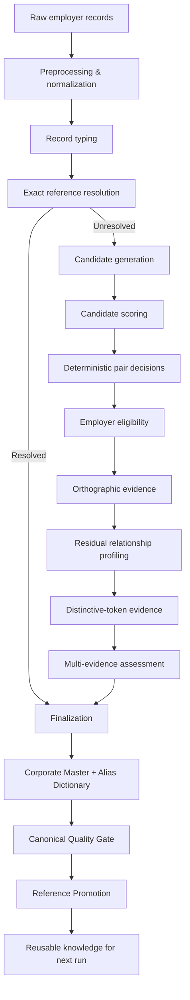

# Employer Entity Resolution & Master Data Platform

**An explainable, precision-first pipeline for turning noisy employer names into trusted canonical entities and reusable master data.**

Free-text employer fields are deceptively difficult: the same organization may appear under legal-suffix variants, abbreviations, typos, truncations, numeric variants, addresses, occupations, or incomplete values. This project resolves that problem with a deterministic and auditable pipeline rather than a single fuzzy-match threshold.

> **Portfolio edition:** the public repository uses a fully synthetic, reproducible dataset. The original private dataset is not distributed.

## Why this project matters

Poor entity quality propagates into concentration analysis, segmentation, customer or employer analytics, data governance, and risk models. The pipeline creates a reusable entity layer while deliberately **abstaining when evidence is insufficient**, protecting the Corporate Master from low-confidence merges.

### What it demonstrates

- Entity Resolution / Record Linkage
- Data Engineering and reproducible batch pipelines
- Data Quality and Master Data Management (MDM)
- Candidate generation instead of all-vs-all comparison
- Explainable multi-evidence matching
- Conservative abstention and quality gates
- Incremental reference reuse
- Automated testing, typing, linting, CLI, CSV and Parquet outputs

## Architecture



The design separates **evidence generation** from **identity decisions**. That makes the resolution path inspectable and prevents similarity scores from silently becoming truth.

## Benchmark snapshot

The following aggregate measurements were obtained on a larger private-source execution. They are presented as sanitized engineering benchmarks; the private records are not included in this repository.

| Metric | Measured result | Why it matters |
|---|---:|---|
| Source records processed | **323,001** | Demonstrates non-trivial batch scale |
| Candidate pairs generated | **2,195,333** | Bounded search replaces all-vs-all comparison |
| Initial Corporate Master | **257,711 entities** | Conservative canonicalization avoids aggressive merges |
| Aliases represented | **308,748** | Preserves source variants for future resolution |
| Exact resolutions on second run | **88,690** | Persistent knowledge resolves records before residual matching |
| Candidate-pair reduction | **601,671 / ~27.4%** | Incremental reuse reduces downstream comparison work |
| Automated tests | **445 passed** | Software-quality controls around data logic |
| Static quality snapshot | **Ruff: all checks passed; mypy: success** | Linting and strict typing across the source package |

### Incremental resolution cycle


This is a key design property: trusted knowledge created in one run can lower the matching workload in later runs without weakening decision thresholds.

## Precision-first design

The system does **not** force every record into a company. A record can remain unresolved when evidence is weak, contradictory, address-like, status-like, or incomplete.

```text
Strong evidence      -> resolve / canonicalize
Insufficient evidence -> abstain
Unsafe master entry   -> do not promote
```

Abstention is a product feature: a false merge can contaminate downstream analytics and future matching, while an unresolved record remains reviewable.

## Public synthetic dataset

The public demo intentionally reproduces the problem shape without exposing source data. It includes fictional examples of:

- spelling errors and single-character edits;
- abbreviations and spacing variation;
- inconsistent legal suffixes;
- 30-character truncation;
- aliases;
- addresses entered as employers;
- occupations and employment statuses;
- incomplete and ambiguous values;
- numeric variants;
- intentionally similar company names.

Committed demo data:

```text
data/sample/synthetic_employers.xlsx          # 5,000 synthetic records
data/sample/synthetic_employers_preview.csv   # GitHub-readable preview
data/reference/employer_master.csv             # synthetic seed master
data/reference/employer_aliases.csv            # synthetic seed aliases
```

Recreate the workbook deterministically:

```bash
python scripts/generate_synthetic_data.py
```

Default committed workbook SHA-256:

```text
0036A9305EBBB3469659A2922BD4E5859712127789CEC312D83BBFCC97D49E2C
```

If you generate a different row count or seed, update `source.expected_sha256` in `config/config.yaml` with the hash printed by the generator.

## Example problem

| Raw value | Intended interpretation |
|---|---|
| `NORTHSTAR LOGISTICS SA` | organization |
| `NORTHSTAR LOGIST SA` | known alias / organization variant |
| `NORTHSTAR LOGITICS SA` | orthographic variant |
| `NORTHSTAR LOGISTICS 3` | numeric variant requiring evidence |
| `CALLE 50 EDIFICIO TORRE NORTE` | address, not an employer |
| `INDEPENDIENTE` | employment status, not an employer |
| `SERVICIOS GENERALES` | ambiguous; conservative handling |
| `UNKNOWN` | insufficient information |

See `examples/` for compact, human-readable portfolio examples.

## Repository structure

```text
.
├── .github/workflows/ci.yml
├── config/config.yaml
├── data/
│   ├── sample/
│   └── reference/
├── docs/
├── examples/
├── scripts/generate_synthetic_data.py
├── src/credit_risk_er/
├── tests/
├── NOTICE.md
├── LICENSE
├── pyproject.toml
└── README.md
```

`data/processed/`, `data/evaluation/`, and `output/` are generated locally and intentionally excluded from version control.

## Installation

Python 3.12 or 3.13 is supported.

```bash
python -m venv .venv
source .venv/bin/activate          # Linux/macOS
# .venv\Scripts\activate        # Windows PowerShell
python -m pip install --upgrade pip
pip install -e ".[dev]"
```

## Run the pipeline

The existing CLI and processing logic are preserved. From the repository root:

```bash
python -m credit_risk_er preprocess
python -m credit_risk_er resolve
python -m credit_risk_er candidates
python -m credit_risk_er score-candidates
python -m credit_risk_er decide-pairs
python -m credit_risk_er classify-eligibility
python -m credit_risk_er resolve-orthographic
python -m credit_risk_er profile-residuals
python -m credit_risk_er compute-distinctive-evidence
python -m credit_risk_er assess-evidence
python -m credit_risk_er finalize
python -m credit_risk_er build-corporate-master
python -m credit_risk_er assess-canonical-quality
python -m credit_risk_er promote-references
```

Use the CLI help for stage-specific overrides:

```bash
python -m credit_risk_er --help
```

## Engineering decisions

### Candidate generation instead of Cartesian comparison
All-vs-all matching grows quadratically. The pipeline first creates bounded candidate sets using deterministic blocking/signature strategies, then computes richer evidence only for plausible pairs.

### Multi-evidence resolution instead of one fuzzy threshold
String similarity alone can create false positives between common or structurally similar company names. The system combines structural, orthographic, token-distinctiveness, numeric, eligibility, and reference evidence before finalization.

### Quality-gated master promotion
A canonical entity is not automatically allowed to become persistent reference knowledge. The quality gate separates promotable from suspicious/non-promotable entities to reduce **master-data contamination**.

### Determinism and auditability
Rules and thresholds are centralized in `config/config.yaml`; intermediate artifacts and metrics make the pipeline traceable stage by stage.

## Testing and code quality

```bash
pytest
ruff check .
mypy src
```

The source package includes extensive unit and pipeline-level tests covering normalization, candidate generation, fuzzy features, deterministic decisions, eligibility, orthographic evidence, residual profiling, multi-evidence assessment, finalization, master construction, quality gates, and incremental behavior.

## Trade-offs and limitations

- The public data is synthetic, so public-demo metrics are not intended to reproduce the private benchmark.
- The current approach is intentionally rules/evidence-driven rather than supervised ML because labeled match/non-match pairs are not assumed.
- Conservative abstention trades recall for safer precision and master quality.
- Public validation/enrichment is intentionally empty in the synthetic demo; no fictional company is presented as externally verified.
- For millions of rows, candidate blocking and storage/execution layers would be adapted to distributed or database-native processing while retaining the same decision principles.

## Where this pattern applies

The architecture generalizes beyond employer data to:

- CRM customer deduplication;
- vendor and supplier master cleanup;
- company/entity matching;
- KYC and financial-data quality;
- product or catalogue record linkage;
- Master Data Management and Data Governance workflows.

## Documentation

- [Architecture and design](docs/architecture.md)
- [Public data contract](docs/data_contract.md)
- [Benchmark interpretation](docs/benchmark_results.md)
- [Data & confidentiality notice](NOTICE.md)

## License

Source code is published for portfolio/review purposes under the terms in [LICENSE](LICENSE). The synthetic data is fictional.
