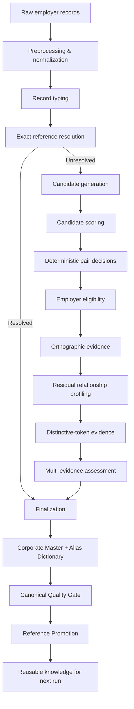

# Employer Entity Resolution & Master Data Platform

**An explainable, precision-first pipeline for turning noisy employer records into trusted canonical entities and reusable master data.**

[](https://github.com/alexisrafaello16/employer-entity-resolution/actions/workflows/ci.yml)


Free-text employer fields are deceptively difficult: the same organization may appear under legal-suffix variants, abbreviations, typos, truncations, numeric variants, addresses, occupations, or incomplete values.

This project addresses that problem with a **deterministic, auditable, and incremental Entity Resolution pipeline** rather than a single fuzzy-match threshold.

> **Portfolio edition:** this public repository uses a fully synthetic, reproducible dataset. The original private dataset is not distributed.

## Key Results

| Metric | Result |
|---|---:|
| Source records processed | **323,001** |
| Candidate pairs generated | **2,195,333** |
| Canonical master entities after conservative resolution | **257,711** |
| Source aliases represented | **308,748** |
| Early exact resolutions on the second run | **88,690** |
| Candidate-pair reduction on the second run | **601,671 / ~27.4%** |
| Automated tests | **445 passed** |
| Static quality checks | **Ruff passed · mypy passed** |

The most important operational result came from **incremental reference reuse**: trusted knowledge created during the first execution resolved **88.7K records before residual matching** in the next run, reducing the downstream candidate universe by approximately **27.4%**.

## Business Problem

Employer information captured as free text is often inconsistent, duplicated, incomplete, or structurally ambiguous.

Typical examples include:

- legal-suffix variants;
- abbreviations and aliases;
- misspellings;
- truncated company names;
- numeric variants;
- addresses entered as employers;
- occupations or employment statuses;
- incomplete records;
- multiple textual representations of the same organization.

Without a trusted entity layer, those inconsistencies propagate into:

- concentration analysis;
- segmentation;
- employer or customer analytics;
- data governance;
- financial-risk workflows;
- downstream models and reporting.

The objective is not to force every record into a company. The objective is to create **trusted canonical entities, reusable aliases, and traceable decisions** while abstaining when the available evidence is not strong enough.

## Architecture



The design deliberately separates **evidence generation** from **identity decisions**. Similarity scores are treated as evidence, not as truth.

## Precision-First Resolution

The system does **not** force every source record into a canonical company.

```text
Strong evidence       -> resolve / canonicalize
Insufficient evidence -> abstain
Unsafe master entry   -> do not promote
```

A false merge can contaminate downstream analytics and persistent master data. An unresolved record, by contrast, remains reviewable.

For that reason, **abstention is a product feature rather than a failure condition**.

### Core capabilities demonstrated

- **Entity Resolution & Record Linkage**
- **Data Engineering & reproducible batch pipelines**
- **Data Quality & Master Data Management**
- **Explainable multi-evidence matching**
- **Conservative abstention and quality gates**
- **Incremental reference reuse**
- **Software engineering: tests, CI, typing, linting, configuration and CLI**

## Incremental Resolution Cycle


Trusted knowledge created in one run can reduce matching work in future runs **without weakening decision thresholds**.

## Benchmark Snapshot

The following aggregate measurements were obtained on a larger private-source execution. They are presented as **sanitized engineering benchmarks**; the underlying private records are not included in this repository.

| Metric | Measured result | Why it matters |
|---|---:|---|
| Source records processed | **323,001** | Demonstrates non-trivial batch scale |
| Candidate pairs generated | **2,195,333** | Bounded search replaces all-vs-all comparison |
| Initial Corporate Master | **257,711 canonical entities** | Conservative resolution preserves uncertain records instead of forcing low-confidence merges |
| Aliases represented | **308,748** | Preserves source variants for future resolution |
| Exact resolutions on second run | **88,690** | Persistent knowledge resolves records before residual matching |
| Candidate-pair reduction | **601,671 / ~27.4%** | Incremental reuse reduces downstream comparison work |
| Automated tests | **445 passed** | Software-quality controls around data logic |
| Static quality snapshot | **Ruff: all checks passed; mypy: success** | Linting and strict typing across the source package |

## Public Synthetic Dataset

The public demo intentionally reproduces the **problem shape** without exposing source data.

It includes fictional examples of:

- spelling errors and single-character edits;
- abbreviations and spacing variation;
- inconsistent legal suffixes;
- 30-character truncation;
- aliases;
- addresses entered as employers;
- occupations and employment statuses;
- incomplete and ambiguous values;
- numeric variants;
- intentionally similar company names.

Committed demo data:

```text
data/sample/synthetic_employers.xlsx          # 5,000 synthetic records
data/sample/synthetic_employers_preview.csv   # GitHub-readable preview
data/reference/employer_master.csv             # synthetic seed master
data/reference/employer_aliases.csv            # synthetic seed aliases
```

Recreate the workbook deterministically:

```bash
python scripts/generate_synthetic_data.py
```

Default committed workbook SHA-256:

```text
0036A9305EBBB3469659A2922BD4E5859712127789CEC312D83BBFCC97D49E2C
```

If you generate a different row count or seed, update `source.expected_sha256` in `config/config.yaml` with the hash printed by the generator.

## Example Problem

| Raw value | Intended interpretation |
|---|---|
| `NORTHSTAR LOGISTICS SA` | organization |
| `NORTHSTAR LOGIST SA` | known alias / organization variant |
| `NORTHSTAR LOGITICS SA` | orthographic variant |
| `NORTHSTAR LOGISTICS 3` | numeric variant requiring evidence |
| `CALLE 50 EDIFICIO TORRE NORTE` | address, not an employer |
| `INDEPENDIENTE` | employment status, not an employer |
| `SERVICIOS GENERALES` | ambiguous; conservative handling |
| `UNKNOWN` | insufficient information |

See [`examples/`](examples/) for compact, human-readable portfolio examples.

## Engineering Decisions

### Candidate generation instead of Cartesian comparison

All-vs-all comparison grows quadratically.

The pipeline first creates bounded candidate sets using deterministic blocking and signature strategies, then computes richer evidence only for plausible pairs.

### Multi-evidence resolution instead of one fuzzy threshold

String similarity alone can produce false positives between common or structurally similar company names.

The system combines:

- structural evidence;
- orthographic evidence;
- token distinctiveness;
- numeric consistency;
- employer eligibility;
- reference evidence;

before finalization.

### Quality-gated master promotion

A canonical entity is **not automatically allowed** to become persistent reference knowledge.

The quality gate separates promotable entities from suspicious or non-promotable entities, reducing the risk of **master-data contamination**.

### Determinism and auditability

Rules and thresholds are centralized in `config/config.yaml`.

Intermediate artifacts and stage-level metrics make the resolution path traceable from raw record to final entity decision.

## Repository Structure

```text
.
├── .github/
│   └── workflows/
│       └── ci.yml
├── config/
│   └── config.yaml
├── data/
│   ├── sample/
│   └── reference/
├── docs/
├── examples/
├── scripts/
│   └── generate_synthetic_data.py
├── src/
│   └── credit_risk_er/
├── tests/
├── NOTICE.md
├── LICENSE
├── pyproject.toml
└── README.md
```

`data/processed/`, `data/evaluation/`, and `output/` are generated locally and intentionally excluded from version control.

## Installation

Python **3.12 or 3.13** is supported.

Create the virtual environment:

```bash
python -m venv .venv
```

### Linux / macOS

```bash
source .venv/bin/activate
```

### Windows PowerShell

```powershell
.venv\Scripts\Activate.ps1
```

Install the project and development dependencies:

```bash
python -m pip install --upgrade pip
pip install -e ".[dev]"
```

## Run the Pipeline

The project exposes a stage-based CLI:

```text
Preprocessing
→ Exact Reference Resolution
→ Candidate Generation
→ Candidate Scoring
→ Deterministic Pair Decisions
→ Employer Eligibility
→ Orthographic Evidence
→ Residual Profiling
→ Distinctive Evidence
→ Multi-Evidence Assessment
→ Finalization
→ Corporate Master
→ Canonical Quality Gate
→ Reference Promotion
```

<details>
<summary><strong>Show CLI commands</strong></summary>

```bash
python -m credit_risk_er preprocess
python -m credit_risk_er resolve
python -m credit_risk_er candidates
python -m credit_risk_er score-candidates
python -m credit_risk_er decide-pairs
python -m credit_risk_er classify-eligibility
python -m credit_risk_er resolve-orthographic
python -m credit_risk_er profile-residuals
python -m credit_risk_er compute-distinctive-evidence
python -m credit_risk_er assess-evidence
python -m credit_risk_er finalize
python -m credit_risk_er build-corporate-master
python -m credit_risk_er assess-canonical-quality
python -m credit_risk_er promote-references
```

</details>

For stage-specific options:

```bash
python -m credit_risk_er --help
```

## Testing and Code Quality

```bash
pytest
ruff check .
mypy src
```

The test suite covers:

- normalization;
- record typing;
- candidate generation;
- fuzzy features;
- deterministic pair decisions;
- employer eligibility;
- orthographic evidence;
- residual profiling;
- distinctive-token evidence;
- multi-evidence assessment;
- finalization;
- Corporate Master construction;
- canonical quality gates;
- reference promotion;
- incremental behavior.

GitHub Actions runs the quality workflow automatically on pushes and pull requests.

## Trade-offs and Limitations

- The public dataset is synthetic, so public-demo metrics are not intended to reproduce the private benchmark.
- The current approach is deliberately rules/evidence-driven rather than supervised ML because labeled match/non-match pairs are not assumed.
- Conservative abstention trades recall for safer precision and master quality.
- Public validation and enrichment are intentionally empty in the synthetic demo; no fictional company is represented as externally verified.
- At multi-million-row scale, candidate blocking and storage/execution layers would be adapted to distributed or database-native processing while preserving the same decision principles.

## Where This Pattern Applies

The architecture generalizes beyond employer data to:

- CRM customer deduplication;
- vendor and supplier master cleanup;
- company/entity matching;
- KYC and financial-data quality;
- product or catalogue record linkage;
- Master Data Management;
- Data Governance workflows.

## Documentation

- [Architecture and design](docs/architecture.md)
- [Public data contract](docs/data_contract.md)
- [Benchmark interpretation](docs/benchmark_results.md)
- [Data & confidentiality notice](NOTICE.md)

## License

Source code is published for portfolio and review purposes under the terms in [LICENSE](LICENSE).

The public synthetic dataset is fictional and does not contain records from the original private source.
