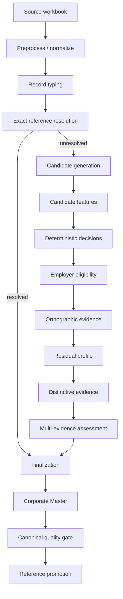
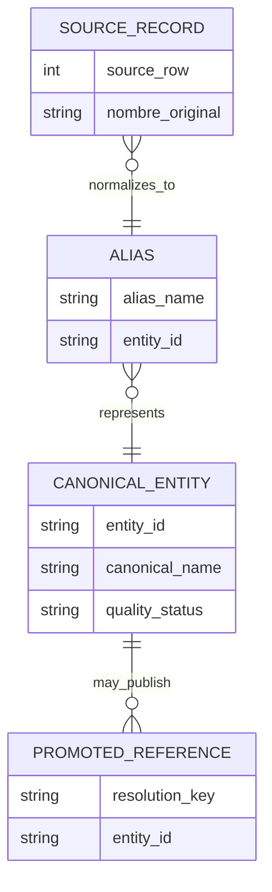

# Architecture & Design Notes

## System boundaries

The pipeline accepts one free-text employer field, validates its source contract, and produces an auditable entity-resolution dataset plus reusable master-data artifacts. Each stage has a deliberately narrow responsibility.

## Raw records, aliases, and canonical entities

## Design principles

1. **Precision before forced coverage.** Unsupported records abstain.
2. **Evidence before decision.** Feature computation does not silently establish identity.
3. **Bounded candidate generation.** Expensive pair evaluation is limited to plausible candidates.
4. **Persistent knowledge is gated.** The master is reusable only after canonical quality checks.
5. **Determinism.** Configuration, stable ordering, fingerprints, metrics, and explicit rules support reproducibility.
6. **Incrementality.** Promoted references can short-circuit later runs through exact resolution.

## Scaling path

The current implementation is a batch Python pipeline using Parquet for intermediate artifacts. At higher scale, the same logical stages can be moved to Spark, SQL/warehouse execution, or distributed batch infrastructure. Candidate blocking should remain partitionable, and persistent master/reference data should be versioned and quality-gated independently from transactional runs.
